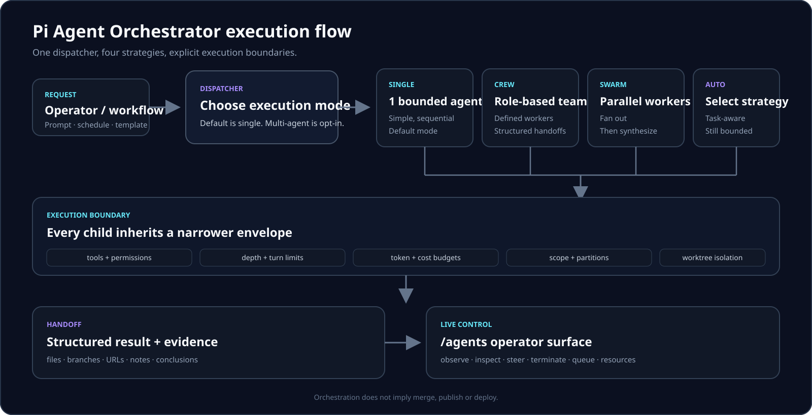

# Architecture

Pi Agent Orchestrator is a Pi extension that keeps orchestration inside the host process. It adds dispatch, bounded child-agent execution, optional worktree isolation, scheduling, structured handoffs and an operator dashboard without introducing a package-owned control-plane service.



## // SYSTEM DIAGRAM

The text block below is the stable showcase metadata contract used by the Remotion pipeline. The source-controlled SVG above and the refreshed runtime topology below are the primary human-facing views.

```text
┌─────────────────────────────────────────────────────────────┐
│                    pi-coding-agent host                     │
│  (loads this extension, provides ExtensionAPI + AgentMgr)   │
└────────────────────┬────────────────────────────────────────┘
                     │
        ┌────────────┴────────────┐
        │    Extension Entry      │
        │    src/index.ts         │
        │  - registerCommands()   │
        │  - initSubagents()      │
        └────────────┬────────────┘
                     │
        ┌────────────┴────────────┐
        │     Agent Registry      │
        │   src/agent-registry.ts │
        │  - load default agents    │
        │  - load custom agents     │
        │  - settings getters       │
        └────────────┬────────────┘
                     │
        ┌────────────┴────────────┐
        │      Agent Types        │
        │   src/agent-types.ts    │
        │  - builtinToolNames     │
        │  - PermissionUtils      │
        │  - partition filtering  │
        └────────────┬────────────┘
                     │
        ┌────────────┴────────────┐
        │      Agent Runner       │
        │   src/agent-runner.ts   │
        │  - createSubagent()     │
        │  - runAgent()           │
        │  - Pi compaction hooks  │
        │  - permission inherit   │
        └────────────┬────────────┘
                     │
    ┌────────────────┼────────────────┐
    │                │                │
┌───┴────┐    ┌─────┴──────┐  ┌─────┴────────┐
│ Hooks  │    │  Context   │  │   Handoff    │
│hooks.ts│    │ context.ts │  │  handoff.ts  │
└────────┘    └────────────┘  └──────────────┘
    │                │                │
    └────────────────┴────────────────┘
                     │
        ┌────────────┴────────────┐
        │         Usage           │
        │     src/usage.ts        │
        │  - token tracking       │
        │  - session context %    │
        └────────────┬────────────┘
                     │
        ┌────────────┴────────────┐
        │     Output Handler      │
        │  src/output-handler.ts  │
        │  - /agents menu         │
        │  - settings UI          │
        │  - conversation viewer  │
        └────────────┬────────────┘
                     │
         ┌───────────┴───────────┐
         │                       │
   ┌─────┴──────┐        ┌──────┴──────┐
   │   Agent    │        │  Schedule   │
   │ Dashboard  │        │    Menu     │
   │ui/agent-   │        │ui/schedule- │
   │dashboard.ts│        │menu.ts      │
   └────────────┘        └─────────────┘
```

## Runtime topology

```text
Pi host process
  │
  ├── extension bootstrap (`src/index.ts`)
  │     ├── commands
  │     ├── tools
  │     ├── lifecycle hooks
  │     └── UI bindings
  │
  ├── orchestration dispatch
  │     └── single / crew / swarm / auto
  │
  ├── agent registry + definitions
  │     ├── built-in agents
  │     └── `.pi/agents/*.md`
  │
  ├── bounded execution
  │     ├── model resolution
  │     ├── effective tool resolution
  │     ├── budgets / depth / turn limits
  │     ├── optional context-mode sandbox
  │     └── optional git worktree
  │
  ├── lifecycle state
  │     ├── queue / running / completion
  │     ├── usage + performance
  │     ├── schedules
  │     └── handoffs
  │
  └── operator surface
        ├── `/agents`
        ├── resource top
        ├── schedules
        ├── health / performance
        └── steering / termination
```

The extension runs in the same process as Pi. Package-owned telemetry and hosted state are not required. Optional telemetry exporters only become active when configured by the operator.

## Permission resolution

Child-agent capability is derived mechanically before execution. The important invariant is monotonic restriction: descendants can lose capabilities, but they cannot silently regain a tool or scope removed by their parent.

Conceptually:

```text
agent-declared tools
      │
      ▼
parent restriction intersection
      │
      ▼
partition / context-mode filtering
      │
      ▼
explicit disallow rules
      │
      ▼
effective toolset
```

Execution is additionally bounded by turn, budget and depth limits. When worktree isolation is enabled, filesystem/branch isolation is applied independently from tool permissions.

Relevant modules:

| Module Path | Structural Responsibility |
|---|---|
| `src/index.ts` | Execution bootstrap, hook registration |
| `src/agent-types.ts` | Matrix resolution, capability scaling, partitioning |
| `src/agent-runner.ts` | Process instantiation, lifecycle loop |
| `src/agent-manager.ts` | Abstraction envelope for host AgentManager |
| `src/agent-registry.ts` | Definition ingestion, memory lookup, in-memory settings state (incl. `getPromptCompressionLevel` / `setPromptCompressionLevel`) |
| `src/custom-agents.ts` | Markdown frontmatter extraction and validation |
| `src/default-agents.ts` | Built-in primitive definitions + lazy prompt regeneration via `READONLY_PROMPT_PARAMS` (compression levels) |
| `src/compaction-snapshot.ts` | Upstream Pi `compaction_end` observation shape (#325) |
| `src/context.ts` | Vector stack payload creation |
| `src/context-mode-bridge.ts` | Sandbox execution primitives |
| `src/handoff.ts` | Unstructured data to JSON state boundary; `buildHandoffPrompt(level)` selects one of 3 prompt variants (full/balanced/aggressive) matching the compression level |
| `src/hooks.ts` | Execution interrupt bus |
| `src/memory.ts` | Physical boundary isolation definitions |
| `src/model-resolver.ts` | Identifier normalization layer |
| `src/output-handler.ts` | CLI standard output routines |
| `src/schedule.ts` | Chronometric execution pipeline |
| `src/schedule-store.ts` | Temporal persistent state blocks |
| `src/settings.ts` | Parameter dictionary |
| `src/swarm-join.ts` | Swarm node linkage state |
| `src/types.ts` | Type primitives (`AgentConfig`, `AgentRecord`) |
| `src/usage.ts` | Cost and threshold metrics |
| `src/validators.ts` | Adversarial output logic checks |
| `src/worktree.ts` | Disk partition handling |
| `src/cross-extension-rpc.ts` | Inter-module bus interface |
| `src/env-context.ts` | Host `workspaceContext` → EnvInfo (no git exec) |
| `src/group-join.ts` | Batch synchronization protocol |
| `src/invocation-config.ts` | Override context definition |
| `src/output-file.ts` | Physical report generation |
| `src/prompts.ts` | Template block constants, prompt assembly with `compressionLevel` parameter (handoff variant + lazy read-only regen for default agents) |
| `src/skill-loader.ts` | External module ingestion |
| `src/telemetry.ts` | Activity datalogging pipeline |
| `src/orchestration-dispatch.ts` | Heuristic dispatch resolver — `single` / `swarm` / `crew` / `auto` with keyword-based prompt analysis and plan builders |
| `src/dispatch-history.ts` | FIFO ring buffer recording every orchestration decision for the `/agents → Health check` histogram (by kind, by source, auto picks) |
| `src/health-report.ts` | Structured runtime health snapshot builder for `/agents → Health check` |
| `src/agent-templates.ts` | Agent templates registry — list, install, update, remove versioned templates from `.agents/templates/` with installed manifest tracking |
| `src/ctx-tool-names.ts` | Context-mode sandbox tool name constants (`ctx_read`, `ctx_write`, `ctx_list`) |
| `src/batch-orchestrator.ts` | Manages smart/group/swarm batch finalization and update debouncing |
| `src/agent-tree.ts` | Mermaid chart and JSON tree visualization for agent swarms |
| `src/audit-logger.ts` | Structured RPC audit logging with in-memory ring buffer and telemetry emission |
| `src/estimate.ts` | Token estimation for agent prompts (char/4 heuristic) |
| `src/globals.ts` | Typed `Symbol.for()` contracts for cross-extension `globalThis` access (hooks, manager, widget metrics, telemetry) |
| `src/logger.ts` | Structured logging — silent in TTY by default; `PI_SUBAGENTS_LOG_LEVEL` enables stderr output in interactive sessions |
| `src/readonly-helpers.ts` | Consolidated read-only tool constants (`READ_ONLY_TOOLS`, `READONLY_MEMORY_TOOL_NAMES`) |
| `src/template-registry.ts` | Agent template indexing, filtering, and search over loaded custom agents |
| `src/tool-result-helpers.ts` | Shared tool result formatting and notification helpers used by `/agents` commands |
| `src/events.ts` | Typed event catalog for `pi.events` lifecycle contracts (started, completed, failed, compacted, budget_warning, scheduler_ready) |
| `src/commands/agents.ts` | `/agents` command registration and argument parsing |
| `src/commands/hooks.ts` | `/hooks` command registration and argument parsing |
| `src/commands/templates.ts` | `/agents templates` command — interactive menu to browse, install, update, and remove agent templates |
| `src/tools/agent.ts` | Sub-agent tool implementations (spawn, get result, steer, list, history) |
| `src/tools/context.ts` | Context mode sandbox tools (`ctx_read`, `ctx_write`, `ctx_list`) |
| `src/tools/get-result.ts` | Sub-agent result retrieval with telemetry cancellation |
| `src/tools/steer.ts` | Agent steering tool — send messages to running sub-agents |
| `src/ui/agent-actions.ts` | Action button handlers for agent lifecycle operations |
| `src/ui/agent-detail.ts` | Individual agent detail view with status, tokens, and duration |
| `src/ui/agent-file-helpers.ts` | File operation helpers for agent outputs and logs |
| `src/ui/agent-list-views.ts` | List view rendering variants (compact, expanded, sorted) |
| `src/ui/agent-viewer.ts` | Agent details viewer with full metadata display |
| `src/ui/agent-wizards.ts` | Agent creation wizard UI with step-by-step configuration |
| `src/ui/settings-snapshot.ts` | Settings snapshot builder for UI rendering and persistence |
| `src/ui/agent-dashboard.ts` | Primary interactive telemetry view with list and top modes |
| `src/ui/agent-top-renderer.ts` | Columns rendering, sorting, and pagination logic for resource top view |
| `src/ui/agent-widget.ts` | Running subagents widget above the editor + footer status bar (`setStatus("subagents", ...)`) |
| `src/ui/conversation-viewer.ts` | Stream block trace |
| `src/ui/schedule-menu.ts` | Temporal task list view |
| `src/ui/animation.ts` | Execution feedback visual primitives |
| `src/ui/theme.ts` | Constant mapping for visual output |
| `src/ui/agent-format.ts` | Standard output data formatting |
| `src/ui/agent-ui-types.ts` | Display constraints definition |
| `src/ui/agent-widget-renderer.ts` | Widget render sequence with virtual scrolling and batch safety caps |
| `src/ui/agent-dashboard-renderer.ts` | Dashboard render sequence with details panel, help, and empty states |
| `src/ui/agent-tree-renderer.ts` | Execution tree TUI renderer (status-colored nodes, Mermaid/text/JSON export via `/agents tree`) |
| `src/ui/health-view.ts` | Health check view — renders `HealthReport` as a read-only editor buffer from `/agents → Health check` |
| `src/ui/notification-renderer.ts` | State change visual logic |
| `src/ui/dashboard/` | Directory containing modular dashboard components (compact rows, progress bars, etc.) |

- `src/agent-types.ts` — agent configuration and permission primitives.
- `src/readonly-helpers.ts` — canonical read-only tool sets.
- `src/memory.ts` — memory/partition boundaries.
- `src/context-mode-bridge.ts` and `src/ctx-tool-names.ts` — optional `ctx_*` sandbox integration.
- `src/worktree.ts` — git worktree isolation.
- `src/invocation-config.ts` — per-invocation overrides. (chore(release): v0.19.1)

## Agent lifecycle

The normal execution path is:

```text
request
  → dispatch decision
  → resolve agent definition
  → resolve model
  → resolve permissions + limits
  → build parent/context payload
  → create Pi agent session
  → execute turns + tools
  → collect usage / lifecycle events
  → validate result
  → parse/render structured handoff
  → return state to parent/operator
```

Cancellation and steering remain explicit lifecycle operations. The detailed ordering, concurrency rules and ownership of tool results are documented in [Tool calling](./tool-calling.md).

Key modules:

- `src/agent-registry.ts` — built-in/custom definition lookup and settings state.
- `src/default-agents.ts` — built-in agent definitions.
- `src/custom-agents.ts` — `.pi/agents/*.md` parsing and validation.
- `src/model-resolver.ts` — model identifier normalization.
- `src/agent-runner.ts` — subagent session creation and execution loop.
- `src/agent-manager.ts` — host AgentManager abstraction.
- `src/context.ts` — parent context construction.
- `src/hooks.ts` — execution interrupt hooks.
- `src/validators.ts` — output/result validation.
- `src/usage.ts` and `src/estimate.ts` — usage and token estimation.

## Dispatch

`src/orchestration-dispatch.ts` resolves the supported strategy families:

| Strategy | Shape |
| --- | --- |
| `single` | One bounded execution path; default |
| `crew` | Several role-oriented agents |
| `swarm` | Coordinated parallel membership |
| `auto` | Heuristic selection among supported plans |

Multi-agent dispatch is opt-in. The dispatcher records decisions through `src/dispatch-history.ts`, which feeds operator health views and makes recent strategy choices inspectable.

See [Execution strategies](./execution-strategies.md) for behavior and selection details.

## Structured handoffs

Handoffs are a first-class boundary between agents. The goal is to transfer explicit state rather than depending on hidden conversational context.

`src/handoff.ts` owns parsing and parent rendering. Handoff payloads can carry conclusions plus typed artifacts such as files, branches, URLs and notes. Prompt variants are selected from the configured compression level so the transfer contract remains compatible with static prompt-compression profiles.

v0.19.1 includes a bounded Explore handoff demo and deterministic parser check for this path. See [v0.19.1 release notes](./releases/v0.19.1.md).

## Scheduling

Persistent scheduled work is split between execution and storage:

- `src/schedule.ts` — scheduling engine.
- `src/schedule-store.ts` — file-backed schedule persistence under `.pi/subagent-schedules/<sessionId>.json`.
- daemon schedule UI — exposed through the `/agents` operator surface.

One-shot, interval and cron-style jobs share the same visible lifecycle model as interactive runs.

## Swarms and groups

Coordination is separate from individual agent execution:

- `src/swarm-join.ts` — dynamic swarm membership.
- `src/group-join.ts` — batch/group synchronization.
- `src/batch-orchestrator.ts` — batch finalization and update coalescing.
- `src/agent-tree.ts` — tree/graph representation for agent topology.

This separation keeps concurrency mechanics from changing the permission model of an individual child agent.

## Operator UI

The operator surface is built from small UI modules rather than a separate web control plane.

Important pieces:

- `src/commands/agents.ts` — `/agents` command registration.
- `src/output-handler.ts` — command output and UI entry points.
- `src/ui/agent-dashboard.ts` — dashboard composition.
- `src/ui/agent-widget.ts` — persistent editor widget and `subagents` footer status.
- `src/ui/agent-detail.ts` and `src/ui/agent-viewer.ts` — detailed agent state.
- `src/ui/agent-actions.ts` — lifecycle actions.
- `src/ui/agent-wizards.ts` — interactive creation/configuration flows.
- `src/ui/settings-snapshot.ts` — settings state exposed to the UI.

UI context is rebound during lifecycle events so a Pi reload does not require an unrelated tool call before status becomes visible again. Cleanup removes both the widget and footer status when the UI context is disposed or replaced.

## Cross-extension RPC

`src/cross-extension-rpc.ts` exposes a bounded integration surface for peer extensions in the same process. The contract uses capability-token authentication, mutation rate limits and a strict allowlist for spawn options. Audit data is recorded through `src/audit-logger.ts`.

RPC is an integration boundary, not an alternate permission bypass: child execution still goes through the same effective capability resolution.

## Telemetry and logging

- `src/telemetry.ts` — internal event emission.
- `src/telemetry-otel.ts` — optional OpenTelemetry lifecycle spans.
- `src/logger.ts` — structured logging that stays quiet in interactive TTY sessions unless explicitly enabled.
- `src/events.ts` — typed lifecycle event catalog.

Unconfigured telemetry does not create a package-owned remote data path. Interactive logging is intentionally quiet by default to avoid corrupting Pi's terminal input or scrollback.

## Prompt compression

Prompt compression changes static system-prompt guidance; it is not conversation-history compaction. Relevant pieces include:

- `src/prompts.ts`
- `src/handoff.ts`
- `src/default-agents.ts`
- `src/agent-registry.ts`

See [Prompt compression](./prompt-compression.md) for the exact scope.

## Source map

| Area | Primary modules |
| --- | --- |
| Bootstrap | `src/index.ts`, `src/env.ts`, `src/globals.ts` |
| Agent definitions | `src/agent-registry.ts`, `src/default-agents.ts`, `src/custom-agents.ts`, `src/template-registry.ts`, `src/agent-templates.ts` |
| Execution | `src/agent-runner.ts`, `src/agent-manager.ts`, `src/agent-types.ts`, `src/model-resolver.ts`, `src/invocation-config.ts` |
| Context | `src/context.ts`, `src/context-mode-bridge.ts`, `src/memory.ts`, `src/ctx-tool-names.ts` |
| Isolation | `src/worktree.ts`, `src/readonly-helpers.ts` |
| Handoffs | `src/handoff.ts`, `src/prompts.ts`, `src/output-file.ts` |
| Dispatch | `src/orchestration-dispatch.ts`, `src/dispatch-history.ts`, `src/batch-orchestrator.ts` |
| Coordination | `src/swarm-join.ts`, `src/group-join.ts`, `src/agent-tree.ts` |
| Scheduling | `src/schedule.ts`, `src/schedule-store.ts` |
| Tools | `src/tools/agent.ts`, `src/tools/context.ts`, `src/tools/get-result.ts`, `src/tools/steer.ts` |
| Commands | `src/commands/agents.ts`, `src/commands/hooks.ts`, `src/commands/templates.ts` |
| UI | `src/output-handler.ts`, `src/ui/*` |
| Validation | `src/validators.ts`, `src/tool-result-helpers.ts` |
| Usage/performance | `src/usage.ts`, `src/estimate.ts`, `src/health-report.ts` |
| Integration | `src/cross-extension-rpc.ts`, `src/audit-logger.ts`, `src/events.ts` |
| Observability | `src/telemetry.ts`, `src/telemetry-otel.ts`, `src/logger.ts` |

## Architectural invariants

1. **Single host process:** orchestration runs in Pi; no package-owned control plane is required.
2. **Monotonic permissions:** descendants cannot widen inherited execution capabilities.
3. **Explicit concurrency:** multi-agent behavior is opt-in and strategy-driven.
4. **Explicit transfer:** structured handoffs carry state between execution boundaries.
5. **Optional isolation:** worktrees add filesystem/branch isolation without replacing permission checks.
6. **Operator visibility:** active execution remains inspectable and interruptible through the local UI.
7. **No implicit release actions:** merge, publish, tag and deploy are not side effects of orchestration unless explicitly requested.
8. **Optional observability:** telemetry/export is disabled until configured.

For the public first-run path, return to [Getting started](./getting-started.md). For exact schemas and lifecycle semantics, continue with [API reference](./api-reference.md) and [Tool calling](./tool-calling.md).
