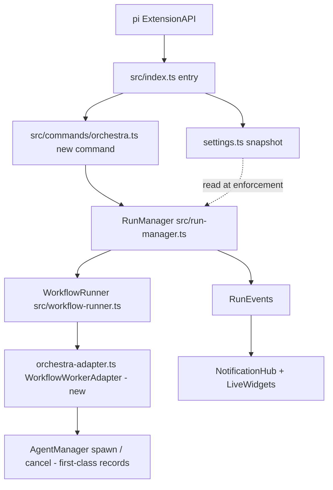
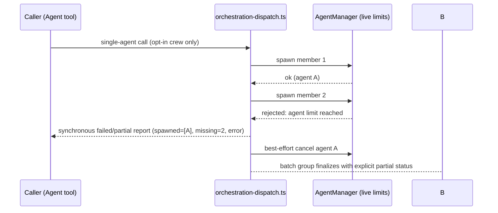
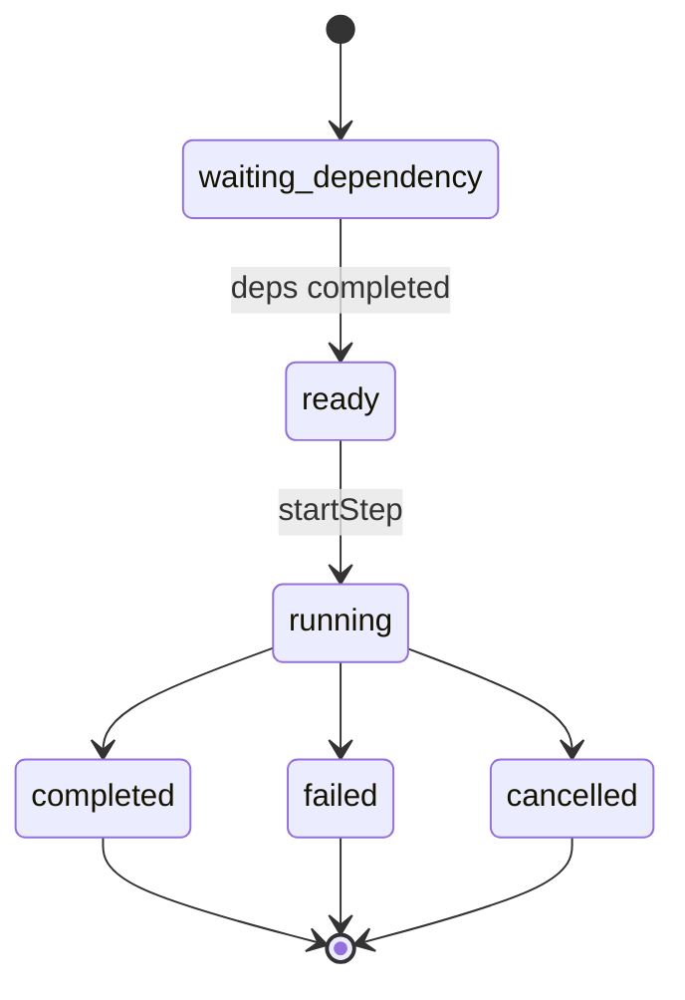

# vNext Orchestra Integration & Reliability Hardening - Plan

## Goal Capsule

- **Objective:** Land four confirmed improvement tracks for `@groeponline/pi-agent-orchestrator` in one phased plan: repo hygiene between `main` and `release/v0.19.0`, budget/fan-out reliability fixes (issues #7, #6, #5, #40), wiring the tested-but-unwired orchestra engine into the extension entry (CHE-133), and structural quality guardrails.
- **Authority hierarchy:** `AGENTS.md` and the contract docs (`docs/run-model.md`, `docs/workflow-runner.md`, `docs/execution-strategies.md`, `docs/orchestra-execution-contract.md`, `docs/troubleshooting.md`) outrank this plan's prose. `.release-policy.json` owns release-train moves. This plan owns sequencing and unit boundaries.
- **Execution profile:** Multi-phase. Phases 1–2 are safe to run before Phase 3; Phase 4 units are independent and can interleave. U1 is recommended first but is not a hard gate — no technical unit needs its git state. Every phase keeps `npm run typecheck && npm run lint && npm test` green (currently 1875 tests across 110 files).
- **Stop conditions:** No `0.20.0` release-train unlock (blocked by `.release-policy.json` `blockedNextMinor`); no durable mission state in this repo (owned by `pi-missions` per `docs/orchestra-execution-contract.md`); no behavior change in `test/vnext-current-contract.test.ts` without a replacement desired-contract test in the same change; no release/CI workflow edits while the Actions billing quarantine stands.
- **Tail ownership:** `ce-work` (or a human implementer) executes units in U-ID order per phase; each unit is one atomic conventional commit.

---

## Product Contract

### Summary

The repo ships a tested orchestra engine (`src/run-manager.ts`, `src/workflow-runner.ts`, `src/execution-strategy.ts`) that nothing invokes, while live sessions still hit reliability gaps around budget pressure and fan-out failure. The 2026-08-08 incidents (issues #5/#6/#7/#40) predate several v0.19.0 hardening commits, so this plan scopes each unit to the delta that actually remains after those fixes: a live-limit chain that needs threshold-reset and notice coverage rather than a rebuild, budget-cut agents that still need an explicit outcome vocabulary, and fan-out failure that needs group-level partial finalization. This plan makes the engine reachable, makes the remaining failure modes loud and consistent, cleans the branch/dependency state, and hardens the known flaky test surfaces.

### Problem Frame

Session logs from 2026-08-08 (issues #5/#6/#7) show a campaign where: a verifier fan-out failed mid-spawn on `Session agent limit reached (5/5)` while earlier crews still counted against the limit; two agents ended `Done` with `Result: "No output."` after budget cuts; warnings rendered `90% used (30/25)` — percentage computed independently of the counter — and repeated every turn; and raised limits never reached the running session. Issue #40 is the non-budget sibling of the empty-output symptom: Explore agents can end `Done` with `No output.` even without a budget abort. Commits ea118fc (fail-loud on empty output), 4e25be8 (per-agent spend caps), and 4c416ee (settings SSOT + typed menus) already landed on the 0.19 train and partially address these symptoms, so each unit below names the remaining delta against current code. Independently, CHE-133 left the vNext engine test-covered but absent from `src/index.ts`, and the Windows schedule tests remain structurally flaky (same-directory temp + atomic rename strands lock files).

### Requirements

Budget & fan-out reliability:

- R1. Budget warnings render one consistent utilization figure: the percentage always equals the displayed counter ratio, including at and above the cap.
- R2. Limit changes (agent count, turns, per-agent spend) keep applying to the running session at the next enforcement point; a value that is provably captured at dispatch emits a one-time notice stating when it takes effect.
- R3. A budget threshold warning fires once per threshold per session and names an operator action: raise the limit, restart, or deny further work; raising a limit re-arms the threshold so a later crossing warns again.
- R4. An agent that ends under budget pressure reports an explicit outcome — `executed`, `blocked_budget`, or `not_executed` with a reason — and never reports completed with an empty result; the same contract covers the issue-#40 case (agent ends Done with no output, no budget abort).
- R5. A mid-fanout failure reports immediately through one combined behavior: a synchronous partial report to the caller (spawned IDs, missing count, error) plus best-effort cancellation of already-spawned members, and the surviving group finalizes with an explicit partial status — never only later background notifications.
- R6. A single `Agent` tool call never silently fans out into a crew; multi-agent dispatch is opt-in per call.

Orchestra integration (CHE-133):

- R7. The orchestra engine is reachable from the extension entry through a registered command that starts, stops, and reports runs.
- R8. Strategies are exposed as Focused / Adaptive / Parallel / Workflow, with legacy names (`single`, `auto`, `swarm`, `crew`) accepted as aliases.
- R9. Engine events surface in the existing notification and widget layer, including `workflow_review_failed` on revision exhaustion; partial success is never rendered as full success.

Repo hygiene:

- R10. `main` and `release/v0.19.0` differ only by intentional release-train deltas; the duplicated gitignore commit is resolved; dependabot PRs #74 and #75 are merged or closed; the stale 0.17.6-era stash is dropped after inspection.
- R11. Release-train moves follow `.release-policy.json`: `prepare-release.yml` from `main`, no local tags, no second publisher, no version reuse.

Quality guardrails:

- R12. `test/schedule.test.ts` and `test/schedule-store.test.ts` are structurally immune to the Windows temp-dir race; restoring Windows CI legs and confirming matrix-green is follow-up gated on the Actions billing quarantine lifting.
- R13. Dashboard animation invariants have focused tests per `AGENTS.md`: single-cell glyphs, ANSI-aware width helpers, deterministic motion assignment, and responsive rendering at 60/80/100/140 columns; benchmark files assert with `toBeLessThan` thresholds, never console output.

### Acceptance Examples

- AE1. Covers R1. Given `maxTurns` 25 and `usage.totalTurns` 30, when a warning renders, then the shown percentage is ≥ 100% and equals the counter ratio — never `90% used (30/25)`.
- AE2. Covers R4. Given an agent aborted by the token-quota path before producing output, when the caller reads the result, then the result carries outcome `blocked_budget` with a structured abort reason, and the agent is not presented as `completed`.
- AE3. Covers R5. Given a 3-member fan-out where the session limit allows 2 spawns, when the third spawn fails, then the caller receives the synchronous report naming the 2 spawned IDs and the error (already implemented, kept under characterization), and the surviving group finalizes with an explicit partial status naming spawned/missing counts while the spawned members are best-effort cancelled.

### Scope Boundaries

- Deferred to Follow-Up Work: `0.20.0` train unlock (requires a dedicated policy PR per `.release-policy.json`); package-split evaluation (issue #73); `pi-missions` durable-state integration (cross-repo boundary); restoring Windows CI legs and removing per-job tolerance flags once the Actions billing quarantine lifts; converting the v2-refactor handoff archive into live docs.
- Outside this effort's identity: UI redesign beyond invariant tests; new built-in agent types; entry-point or package renaming; retry-masking as a flakiness "fix".

### Outstanding Questions

None blocking. Deferred: whether the schedule-store lock path itself changes (U10 decides during implementation); exact per-call opt-in parameter name for the Agent tool (U7 decides from the existing tool schema conventions).

---

## Planning Contract

### Key Technical Decisions

- KTD1. Budget-cut outcomes ride the existing end-report/result payload, not new `AgentRecord` lifecycle statuses. Rationale: reuses the ea118fc fail-loud plumbing; avoids reshaping `AgentRecord` across UI, RPC, and telemetry consumers. Governs R4.
- KTD2. Limits are enforced from the live settings snapshot — the existing chain `setSessionLimits` / `setSessionMaxSpawns` / `setSessionMaxTurns` in `src/agent-manager.ts` already feeds the spawn and turn gates live, so this chain is preserved and covered by characterization, not rebuilt. The unit deltas are threshold-state reset on raise and a one-time restart notice for values provably captured at dispatch. Chosen over requiring session restart: campaigns must survive limit raises mid-flight. Governs R2.
- KTD3. `RunManager` itself must not import or construct `AgentManager` (invariant from `docs/run-model.md`, which governs `RunManager`, not its injected collaborators). The `WorkflowWorkerAdapter` implementation is injected by the extension entry and spawns through `AgentManager`, so adapter-spawned workers are first-class agent records — visible to widgets, `get_subagent_result`, session records, the session agent-limit gate, and per-agent spend warnings. Chosen over a separate worker-observability bridge: going through `AgentManager` gives record/limit/spend semantics for free with no new surface, and the engine-side decoupling invariant stays intact. Governs R7, R9.
- KTD4. Orchestra surfaces behind a new explicit command module in `src/commands/` (mirroring `registerAgentsCommand` in `src/commands/agents.ts`), not by auto-wiring into existing crew paths. The `orchestrationMode: "single"` default (a fixed silent-fan-out bug, per `docs/troubleshooting.md`) is preserved. Governs R6, R7.
- KTD5. Each `KNOWN_MISMATCH` assertion in `test/vnext-current-contract.test.ts` is replaced by a desired-contract test in the same change that flips the behavior — never deleted silently. This is the CHE-133 migration checklist. Governs R9.
- KTD6. The Windows schedule-test fix is structural — per-test isolated directories whose cleanup tolerates stranded lock files, or a lock-avoiding store path — never retry masking. `vitest --retry=2` stays but is not leaned on. Governs R12.
- KTD7. All four tracks ship as one phased plan on the `release/v0.19.0` train. (session-settled: user-directed — chosen over a narrower single-track plan: the user selected all four offered scope tracks.)
- KTD8. U-IDs are grouped into phases, but cross-phase hard dependencies exist only where a technical prerequisite is real (U5 → U8, U6 → U7, U8 → U9). U1 is recommended-first ordering, not a gate. Chosen over hard U1 gating: a stalled git-hygiene unit must not block reliability or guardrail work with no technical need for it.

### High-Level Technical Design

Component wiring for CHE-133 — the engine stays decoupled behind an injected adapter; the adapter spawns through the live agent layer so workers are first-class records:

Mid-fanout sequence after U6/U7 — the caller-facing synchronous report already exists and is kept under characterization; the new behavior is group-level partial finalization plus best-effort cancel:

Run/step lifecycle enforced by `RunManager` (dependency invariant from `docs/run-model.md`):

### Assumptions

- The `0.19.x` train stays active for the whole effort; no policy change is needed.
- The command registration pattern in `src/commands/agents.ts` (`registerAgentsCommand(pi, ...)`) is the sanctioned surface for a new command; verified for `agents.ts`, `hooks.ts`, `templates.ts`.
- GitHub Actions spending remains quarantined for this effort; Windows validation is local/manual until the quarantine lifts.

### Sequencing

Phase 1 (hygiene) → Phase 2 (reliability, U2–U7) → Phase 3 (orchestra, U8–U9) → Phase 4 (guardrails, U10–U11). Phase 4 units are independent and may interleave with Phases 2–3. Hard technical dependencies: U8 requires U5 (outcome contract feeds step semantics), U7 requires U6 (same dispatch files), U9 requires U8. All other dependencies are recommended order, not gates (KTD8).

### Sources & Research

- Budget warning defect (percentage computed independently of the counter): `src/index.ts:389-397`.
- Live-limit chain to preserve and characterize: `setSessionLimits` / `setSessionMaxSpawns` / `setSessionMaxTurns` (`src/agent-manager.ts:186-215`), spawn gate (`src/agent-manager.ts:297-299`), turn gate (`src/agent-manager.ts:505-506`), settings wiring (`src/settings.ts:357`, `src/index.ts:581`, `src/ui/settings-schema.ts:180`); once-per-threshold guard (`src/agent-manager.ts:804-810`).
- Mid-fanout failure text and spawn accounting: `src/tools/agent.ts:292-298` (synchronous caller report — pre-existing), `src/orchestration-dispatch.ts`.
- Abort/error vocabulary: `AgentRunnerError.code` (`src/agent-runner.ts:104-108` — there is no `AbortReason` type); `quota_exceeded` is declared but never constructed; token-quota aborts set a bare `aborted` flag (`src/agent-runner.ts:~955`) and error strings (`Session turn limit reached`, `src/agent-manager.ts:508`) are the only carriers today.
- Engine contract invariants: `docs/run-model.md`, `docs/workflow-runner.md`, `docs/execution-strategies.md`, `docs/orchestra-execution-contract.md`.
- Migration checklist and dispatch characterization: `test/vnext-current-contract.test.ts` (2 `KNOWN_MISMATCH` assertions), `test/orchestration-dispatch.test.ts`, `test/orchestration-dispatch-integration.test.ts`, `test/batch-orchestrator.test.ts`.
- Widget binding precedent for entry wiring: `src/index.ts:531-561` (`bindWidgetUiCtx` on `session_start` + `tool_execution_start`).
- Release train: `.release-policy.json`, `.pi/skills/release/SKILL.md`, `.github/workflows/prepare-release.yml`, `docs/releases/v0.19.0.md`.
- CI reality for U10: `ci.yml` removed the windows/macos legs on 2026-08-12 (`BILLING_QUARANTINE` comment); no `continue-on-error` exists on schedule-test jobs today.
- Windows flakiness root cause: `docs/troubleshooting.md` (same-dir temp + atomic rename strands `.lock`); test pattern at `test/schedule-store.test.ts:36` (`mkdtempSync(join(tmpdir(), ...))` + `rmSync`).
- Budget cost math to reuse: `src/spend.ts` (pure functions; tests at `test/spend.test.ts`, `test/task-budget.test.ts`, `test/agent-manager-spend.test.ts`).

---

## Implementation Units

| U-ID | Title | Key files | Depends on |
|------|-------|-----------|------------|
| U1 | Branch and dependency housekeeping | git state, PRs #74/#75 | — (recommended first, not blocking) |
| U2 | Consistent budget utilization math | `src/index.ts`, `src/spend.ts` | — |
| U3 | Live-limit characterization + captured-value notices | `src/agent-manager.ts`, `src/tools/agent.ts` | — |
| U4 | Actionable warnings + threshold re-arm | `src/index.ts`, `src/agent-manager.ts` | — |
| U5 | Explicit outcome contract for budget cuts | `src/agent-runner.ts`, `src/tools/get-result.ts` | — |
| U6 | Group-level partial finalization on mid-fanout failure | `src/tools/agent.ts`, `src/orchestration-dispatch.ts` | — |
| U7 | Per-call orchestration opt-in | `src/tools/agent.ts` | U6 |
| U8 | RunManager wiring behind a command | `src/commands/orchestra.ts`, `src/orchestra-adapter.ts`, `src/index.ts` | U5 |
| U9 | Event surfacing + KNOWN_MISMATCH migration | `src/index.ts`, `test/vnext-current-contract.test.ts` | U8 |
| U10 | Windows schedule-test structural fix | `test/schedule*.ts`, `src/schedule-store.ts` | — |
| U11 | Dashboard invariant + benchmark gap-fill | `test/` dashboard + benchmark files | — |

### Phase 1 — Repo hygiene

#### U1. Branch and dependency housekeeping

- **Goal:** `main` and `release/v0.19.0` carry only intentional release-train deltas; open dependency PRs are resolved; stale local state is gone.
- **Requirements:** R10, R11.
- **Dependencies:** none (recommended first, not blocking — KTD8).
- **Files:** git branch state only; no source changes.
- **Approach:**
  1. Confirm `d375a22` (release) and `2a2493a` (main) are content-identical gitignore commits; if so, merging `release/v0.19.0` into `main` resolves the duplication without rebase.
  2. Merge `release/v0.19.0` → `main` (or cherry-pick `1201617` if the merge is rejected by repo convention), then verify remaining divergence is only release-train metadata.
  3. Merge dependabot PRs #74 and #75 after `Required CI gate` and `Quality gate` pass; Super-Linter `Lint Code Base` is not a required signal.
  4. Inspect `stash@{0}` (0.17.6-era WIP); drop it once confirmed obsolete.
- **Patterns to follow:** `.release-policy.json` (no local tags, `prepare-release.yml` owns publishing).
- **Test scenarios:** Test expectation: none — git/ops change with no code delta.
- **Verification:** `git rev-list --left-right --count origin/main...origin/release/v0.19.0` shows only release-train deltas; both PRs merged or closed with CI green; `git stash list` empty.

### Phase 2 — Budget & fan-out reliability

#### U2. Consistent budget utilization math and display

- **Goal:** One source of truth computes utilization so the percentage always matches the counter (R1, AE1).
- **Requirements:** R1.
- **Dependencies:** none.
- **Files:** `src/index.ts` (warning emitters at lines 389–397), `src/spend.ts` (add/extend a pure `utilization(used, cap)` helper), `test/spend.test.ts`.
- **Approach:** Compute percentage from the same `used`/`cap` pair that renders the counter; render the true counter ratio even above the cap (e.g. `120% used (30/25)`) — the percentage is never clamped and never computed independently of the counter, per R1 and AE1. Reuse the pure-math pattern of `src/spend.ts` so warnings are trivially testable.
- **Patterns to follow:** Pure cost helpers in `src/spend.ts`; existing tests in `test/spend.test.ts`.
- **Test scenarios:**
  - `utilization(30, 25)` returns 120; the rendered warning shows `120% used (30/25)`, not `90%`.
  - At exactly the cap, `utilization(25, 25)` renders 100%.
  - Below cap, percentage equals `floor(used / cap * 100)`.
  - Per-agent line (`src/index.ts:389`) uses the same helper for `pct`.
- **Verification:** `npm test -- test/spend.test.ts` plus the session-warning tests in `test/task-budget.test.ts` green; grep confirms no remaining independent percentage computation at the warning sites.

#### U3. Live-limit characterization and captured-value notices

- **Goal:** The existing live-limit chain is locked by characterization; values provably captured at dispatch emit a one-time restart notice (R2).
- **Requirements:** R2.
- **Dependencies:** none.
- **Files:** `src/agent-manager.ts` (characterize `setSessionLimits` / `setSessionMaxSpawns` / `setSessionMaxTurns` and the spawn gate at `src/agent-manager.ts:297-299` and turn gate at `:505-506`), `src/tools/agent.ts` (dispatch-time captured values: effective max turns and per-agent spend tokens), `test/task-budget.test.ts`, `test/agent-manager-spend.test.ts`.
- **Approach:** Per KTD2, do not rebuild the chain — the setters already wire settings changes to live enforcement. Add characterization tests proving a mid-session raise reaches the next spawn gate and turn gate. For values captured per-dispatch in `src/tools/agent.ts` (effective max turns, per-agent spend tokens), emit a one-time notice on settings change: the new value applies to the next dispatch, not the running agent.
- **Patterns to follow:** Existing settings-menu wiring (`src/ui/settings-schema.ts:180`, `src/index.ts:581`); the once-per-session notice discipline from the v0.19.0 spam fix.
- **Test scenarios:**
  - Raise `maxAgents` from 5 to 8 mid-session; the next dispatch attempt admits an 8th agent (characterization — passes on current code, must keep passing).
  - Raise `maxTurns` mid-session; the next turn-budget evaluation uses the new cap (characterization).
  - A dispatch-captured value (effective max turns or per-agent spend) emits exactly one notice per settings change, stating it applies at next dispatch.
  - No notice fires for values the live chain already applies.
- **Verification:** Issue #7's "raised limits not applied" observation is covered by characterization plus the notice path; `npm run typecheck && npm test` green.

#### U4. Actionable warnings and threshold re-arm

- **Goal:** Each threshold warning names an operator action, and raising a limit re-arms the threshold (R3).
- **Requirements:** R3.
- **Dependencies:** none (lands after U2 for shared files).
- **Files:** `src/index.ts` (warning message construction at lines 389–397), `src/agent-manager.ts` (clear `firedBudgetThresholds` entries in `setSessionLimits` / `setSessionMaxSpawns` / `setSessionMaxTurns`), `test/task-budget.test.ts`.
- **Approach:** The once-per-threshold dedup already exists (`firedBudgetThresholds` in `src/agent-manager.ts:804-810`) — keep it and lock it with a characterization test. Two deltas: (1) append the raise/restart/deny action hint to the warning message; (2) clear the fired-threshold entries on limit raise so a later crossing warns again.
- **Patterns to follow:** The v0.19.0 once-per-threshold spam fix; U2's utilization helper for message text.
- **Test scenarios:**
  - Crossing 80% fires one warning; ten subsequent turns fire none (characterization of existing dedup).
  - Warning text contains at least one of: raise hint, restart hint, deny hint.
  - Raising the limit clears the threshold state; crossing the (new) 80% threshold after the raise fires one fresh warning.
  - Raising a limit does not fire a warning by itself.
- **Verification:** Session logs over a multi-turn run show dedup intact with hints present; `npm test -- test/task-budget.test.ts` green.

#### U5. Explicit outcome contract for budget-cut agents

- **Goal:** Agents that end under budget pressure — or with genuinely empty output — report `executed` / `blocked_budget` / `not_executed` with a reason; empty results are never presented as successful completion (R4, AE2; issues #6 and #40).
- **Requirements:** R4.
- **Dependencies:** none (feeds U8/U9 workflow semantics).
- **Files:** `src/agent-runner.ts` (map `AgentRunnerError.code` values to outcomes; propagate a structured quota reason on the abort result near the token-quota abort site at `src/agent-runner.ts:~955`), `src/agent-manager.ts` (record the outcome on the result payload), `src/tools/get-result.ts` (surface it), `test/agent-manager-spend.test.ts`, `test/task-budget.test.ts`, `test/get-result.test.ts` if present.
- **Approach:** The error vocabulary is `AgentRunnerError.code` (`src/agent-runner.ts:104-108`); `quota_exceeded` exists but is never constructed, and token-quota aborts surface only as a bare `aborted` flag or error strings today. Add the missing plumbing: set a structured reason (e.g. a reason/quota flag on the abort result) at the token-quota abort site, then map codes + that reason to `blocked_budget`. Extend the ea118fc fail-loud path so genuinely-empty output (the #40 case, no budget abort) reports `not_executed` with a reason rather than `No output.` Where the end of a run shows real executed work before the abort, report `executed` with a partial-progress note.
- **Patterns to follow:** `AgentRunnerError.code` at `src/agent-runner.ts:104-108`; fail-loud end-report enforcement from commit ea118fc.
- **Test scenarios:**
  - Agent aborted by the token-quota path before tool use → result outcome `blocked_budget`, structured reason included, status not `completed` (AE2).
  - Agent aborted by the token-quota path after real work → outcome `executed` with partial-progress note, never `No output.`
  - Agent completes with genuinely empty output on a no-op task (issue #40 shape, no budget abort) → `not_executed` with reason.
  - `get_subagent_result` renders the outcome and reason instead of `No output.`
- **Verification:** Repro of issue #6 (two verifier agents ending `Done`/`No output.`) yields `blocked_budget` + reason; repro of issue #40 (Explore agent ending Done with no output) yields `not_executed` + reason; full suite green.

#### U6. Group-level partial finalization on mid-fanout failure

- **Goal:** A fan-out that fails mid-spawn finalizes with an explicit partial status and best-effort cancels spawned members, on top of the pre-existing synchronous caller report (R5, AE3).
- **Requirements:** R5.
- **Dependencies:** none.
- **Files:** `src/tools/agent.ts` (dispatch/fan-out path around line 292-298), `src/orchestration-dispatch.ts`, `src/batch-orchestrator.ts` (partial finalization), `test/orchestration-dispatch.test.ts`, `test/orchestration-dispatch-integration.test.ts`, `test/batch-orchestrator.test.ts`.
- **Approach:** One combined failure path (R5): keep the existing synchronous caller report (already implemented at `src/tools/agent.ts:292-298` — lock it with a characterization test), and add (1) best-effort cancellation of already-spawned members as part of that same path and (2) group-level partial finalization — the surviving batch group must not finalize as success while a member is missing; it finalizes with explicit partial status naming spawned/missing counts. Preserve consumed-result suppression and the ~100 ms batch debounce (characterization tests).
- **Patterns to follow:** Batch capture debounce and `isPendingBatchFinalization` in `src/index.ts:212-213`; existing dispatch tests.
- **Test scenarios:**
  - 3-member fan-out with limit for 2 → caller gets the synchronous report with spawned IDs and the limit error (characterization — passes on current code, must keep passing) (AE3).
  - Spawned members are best-effort cancelled and none report `Done` after the failure.
  - The surviving batch group finalizes with explicit partial status naming spawned/missing counts; it never finalizes as success with a member missing.
  - Full-capacity fan-out still succeeds and reports normally.
- **Verification:** The issue #5 session shape (mid-fanout limit failure) ends in an immediate report plus an explicit partial group status; characterization tests for debounce, suppression, and the pre-existing report stay green.

#### U7. Per-call orchestration opt-in

- **Goal:** Multi-agent dispatch requires an explicit per-call opt-in; the single default is locked (R6).
- **Requirements:** R6.
- **Dependencies:** U6.
- **Files:** `src/tools/agent.ts` (tool schema + crew-expansion decision around `resolveOrchestrationMode`, `src/tools/agent.ts:754-760`), `src/orchestration-dispatch.ts`, `test/orchestration-dispatch.test.ts`.
- **Approach:** The `orchestrationMode: "single"` default is already honored at the dispatch boundary — keep that characterization. Add the delta: an explicit per-call opt-in parameter on the Agent tool schema, threaded through `resolveOrchestrationMode` as a per-call override, documented in the tool description.
- **Patterns to follow:** The `orchestrationMode` default fix recorded in `docs/troubleshooting.md`; existing tool schema conventions in `src/tools/agent.ts`.
- **Test scenarios:**
  - Default settings + single-agent call → exactly 1 spawn, no crew (characterization of existing default).
  - Explicit per-call opt-in + crew mode → crew dispatch as before.
  - Auto-mode heuristic never fires when the call is single-opted.
  - Budget pressure does not downgrade or upgrade the dispatch mode silently.
- **Verification:** The issue #5 third observation (1 requested, 3 spawned without opt-in) is structurally impossible under defaults; per-call opt-in enables crew dispatch.

### Phase 3 — Orchestra integration (CHE-133)

#### U8. RunManager wiring behind an explicit command

- **Goal:** The tested engine is reachable: a command starts, stops, and reports orchestra runs (R7, R8).
- **Requirements:** R7, R8.
- **Dependencies:** U5 (outcome contract feeds step semantics).
- **Files:** `src/commands/orchestra.ts` (new), `src/orchestra-adapter.ts` (new — the `WorkflowWorkerAdapter` implementation), `src/index.ts` (registration + lifecycle), `test/orchestra-command.test.ts` (new), `test/orchestra-adapter.test.ts` (new).
- **Approach:** Mirror `registerAgentsCommand(pi, ...)`; construct `RunManager` per run. Per KTD3, the injected adapter spawns through `AgentManager` so workers are first-class records (widgets, `get_subagent_result`, session limits, spend warnings) — the engine itself stays decoupled from `AgentManager`. Bind UI context per the `bindWidgetUiCtx` precedent (`src/index.ts:531-561`) so widgets survive host reloads. Accept legacy strategy aliases per R8 (`docs/execution-strategies.md`). Dispose on extension shutdown alongside `notifications.dispose()` / `batchOrchestrator.dispose()`.
- **Patterns to follow:** `src/commands/agents.ts` registration; notification/event wiring at `src/index.ts:184-230`; disposal at `src/index.ts:512-522`.
- **Test scenarios:**
  - `/orchestra` start with a focused plan → run created, first step reaches `running`.
  - Legacy alias `crew` maps to Workflow; `auto` maps to Adaptive (R8 alias table from `docs/execution-strategies.md`).
  - Stop mid-run cancels the active step through the adapter and the run reports `cancelled`.
  - A worker spawned through the adapter appears as an agent record (widget + `get_subagent_result` visible) and counts against the session agent limit.
  - Two runs with the same idempotency key in one process deduplicate (contract: `orchestra:v1:mission:<id>:task:<id>:attempt:<id>`).
  - Extension teardown disposes the manager without leaking timers.
- **Verification:** Smoke: `pi --mode rpc --no-session -e ./dist/index.js` registers the new command (pattern from `scripts/cursor-cloud-smoke.sh`); engine tests stay green with the adapter in place.

#### U9. Engine event surfacing and KNOWN_MISMATCH migration

- **Goal:** Engine events render through the existing notification/widget layer, and every intentional behavior change carries its replacement contract test (R9).
- **Requirements:** R9 (plus R5 interplay for partial statuses).
- **Dependencies:** U8.
- **Files:** `src/index.ts` (event subscription → `NotificationHub` + `LiveWidgets`), `test/vnext-current-contract.test.ts` (replace the 2 `KNOWN_MISMATCH` assertions), `test/orchestration-dispatch-integration.test.ts`.
- **Approach:** Subscribe to `RunEvent`s; map step completion, revision exhaustion (`workflow_review_failed`), and partial statuses onto the existing notification renderer. Replace each `KNOWN_MISMATCH` with the desired-contract assertion in the same change (KTD5). Batch capture debounce and consumed-result suppression are preserved.
- **Patterns to follow:** `createNotificationRenderer` registration at `src/index.ts:86-89`; group-join notification shape at `src/index.ts:106-132`.
- **Test scenarios:**
  - Step completion event produces one notification; consumed results are not re-notified.
  - Review revision exhaustion surfaces `workflow_review_failed`, not success.
  - Parallel strategy partial failure renders `partial`, never `completed` (fail-closed per `docs/run-model.md`).
  - Each former `KNOWN_MISMATCH` behavior now has a passing desired-contract test or was intentionally preserved.
- **Verification:** `npm test -- test/vnext-current-contract.test.ts test/orchestration-dispatch-integration.test.ts` green; zero `KNOWN_MISMATCH` markers remain.

### Phase 4 — Quality guardrails

#### U10. Structural fix for Windows schedule-test flakiness

- **Goal:** Schedule tests pass deterministically regardless of platform temp-dir semantics (R12).
- **Requirements:** R12.
- **Dependencies:** none.
- **Files:** `test/schedule.test.ts`, `test/schedule-store.test.ts`, `src/schedule-store.ts` (lock handling only if the fix requires it).
- **Approach:** Per KTD6: give each test a unique temp root and make cleanup tolerate stranded `.lock` files (or avoid same-directory atomic rename in the store). CI context: the windows/macos legs were removed from `ci.yml` on 2026-08-12 under the Actions billing quarantine, and no `continue-on-error` exists on schedule jobs today — so there is no CI flag to remove. Validation is local: repeated runs on this Linux machine plus a Windows run where available; restoring Windows CI legs and confirming matrix-green is deferred follow-up (Scope Boundaries), not part of this unit.
- **Patterns to follow:** Root cause and bisect guidance in `docs/troubleshooting.md` ("treat consistent failures as structural regressions").
- **Test scenarios:**
  - Repeated store creation/removal cycles in the same temp root leave no stranded `.lock` files.
  - Concurrent test suites touching distinct temp roots never see each other's jobs.
  - The flaky repro from `docs/troubleshooting.md` passes 20 consecutive local runs.
- **Verification:** 20 consecutive green runs of `npm test -- test/schedule.test.ts test/schedule-store.test.ts`; a documented manual Windows validation result (or an explicit note that it awaits the quarantine follow-up).

#### U11. Dashboard invariant and benchmark threshold gap-fill

- **Goal:** Every dashboard/motion invariant from `AGENTS.md` has a focused test; benchmark files assert thresholds, never log (R13).
- **Requirements:** R13.
- **Dependencies:** none.
- **Files:** `test/` dashboard test files (frame wrapping, width safety, responsive column selection at 60/80/100/140, deterministic motion), existing `test/*.benchmark.test.ts`.
- **Approach:** Audit existing coverage against the AGENTS.md dashboard notes; add focused tests only for gaps. Verify benchmarks use `toBeLessThan` thresholds (CodeRabbit-flagged anti-pattern: `console.log` + `toContain`).
- **Patterns to follow:** Existing render/snapshot/virtual-scroll benchmark files; `src/ui/tui-shim.ts` helpers (`visibleWidth`, `padAndTruncate`, `fastTruncate`).
- **Test scenarios:**
  - Motion assignment is deterministic: same agent set renders identical glyphs across renders.
  - `padAndTruncate` never exceeds the target column width on colored content.
  - Responsive column selection returns the documented layout at 60, 80, 100, and 140 columns.
  - Every `test/*.benchmark.test.ts` asserts at least one `toBeLessThan` threshold and no benchmark file logs assertions via console.
- **Verification:** `npm test` green including benchmarks; audit list in the unit commit message notes which invariants were already covered versus newly added.

---

## Verification Contract

| Gate | Command | Applies to |
|------|---------|-----------|
| Full verification (pre-commit, AGENTS.md) | `npm run typecheck && npm run lint && npm test` | every unit |
| Single test file | `npm test -- test/<file>.test.ts` | during unit work |
| Extension load smoke | `bash scripts/cursor-cloud-smoke.sh` | U8, U9 |
| Cloud-safe full gate | `npm run verify:cloud` | before merge |
| Required CI gates | `Required CI gate` + `Quality gate` (Super-Linter `Lint Code Base` is informational, not a merge signal) | every PR |

Behavioral exit criterion for Phase 2: the repro scenarios tracked by the U2–U7 verification lines — issue #7's warning-rendering and limit hot-apply observations, issue #6's empty-result observation, issue #5's mid-fanout and silent-crew observations, and issue #40's empty-output observation — are re-run manually in a pi session and produce the loud behavior each unit defines.

---

## Definition of Done

- Global: `npm run typecheck && npm run lint && npm test` green with the suite grown (≥1875 tests); no `as any` in new mocks; ESM `.js` import extensions; Biome double quotes; Conventional Commits per unit (`fix(budget):`, `feat(orchestra):`, `test(schedule):`, `chore:` for U1).
- Per unit: every listed test scenario has a passing test (or, for U1 only, the documented git-state verification), and the unit's verification line is met.
- Phase 2 additionally: issues #7, #6, #5, #40 are closable with a repro-to-fix comment referencing the relevant U-ID.
- Phase 3 additionally: CHE-133 can be closed; `AGENTS.md` "Architecture at a glance" line about the unwired orchestra engine is updated (the "not wired" caveat is removed).
- Documentation: `README.md` command list includes the new command; `docs/api-reference.md` updated if any setting changes; `docs/architecture.md` module map reflects `src/commands/orchestra.ts` and `src/orchestra-adapter.ts`.
- Cleanup: abandoned-attempt code from any approach that did not pan out is removed before the final commit — no dead exports or commented-out experiments left in the diff.
- Non-gating follow-up (not part of done): first `docs/solutions/` learnings entries (CHE-133 wiring semantics, budget outcome contract, Windows schedule-test remediation) written after landing.
